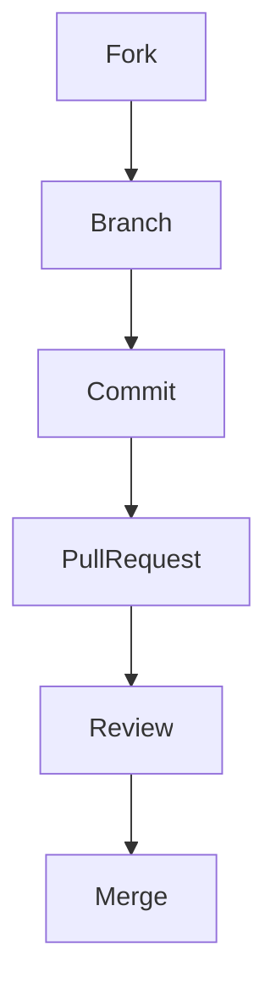

# Contributing to ARC Runner

Thank you for considering contributing to ARC Runner! Your contributions are welcome to help improve the project. Please read this document to learn how to collaborate.

## Code of Conduct

Please read our [Code of Conduct](CODE_OF_CONDUCT.md) to understand the standards we follow in the community.

## How Can I Contribute?

### Reporting Bugs

- Before opening a bug, search for existing issues.
- If you don't find one, create a new issue detailing the problem and how to reproduce it.

### Suggesting Enhancements

- For new features or improvements, check if there is already an issue or discussion.
- If not, create an issue explaining your suggestion and use case.

### Pull Requests

1. Fork the repository and create a branch for your change.
2. Make your changes following the project's standards.
3. Write clear and concise commit messages.
4. Create a pull request referencing related issues.

### Contribution Flow



## Coding Standards

- Follow the project's style and conventions.
- Include tests for new features or fixes.
- Keep your changes focused; avoid unrelated changes in the same PR.

## Development Tools

- Lint: `prettier`, `eslint` (for JS/TS)
- Tests: `dotnet test`, `pytest`, `jest` (according to the language)

## Development Environment

1. Clone the repository:
	```sh
	git clone https://github.com/your-user/arc-runner.git
	cd arc-runner
	```
2. Install dependencies according to the language:
	- Node.js: `npm install`
	- Python: `pip install -r requirements.txt`
	- .NET: `dotnet restore`

## Contact

If you have questions, open an issue or email: <arc-maintainer@example.com>

Thank you for contributing!